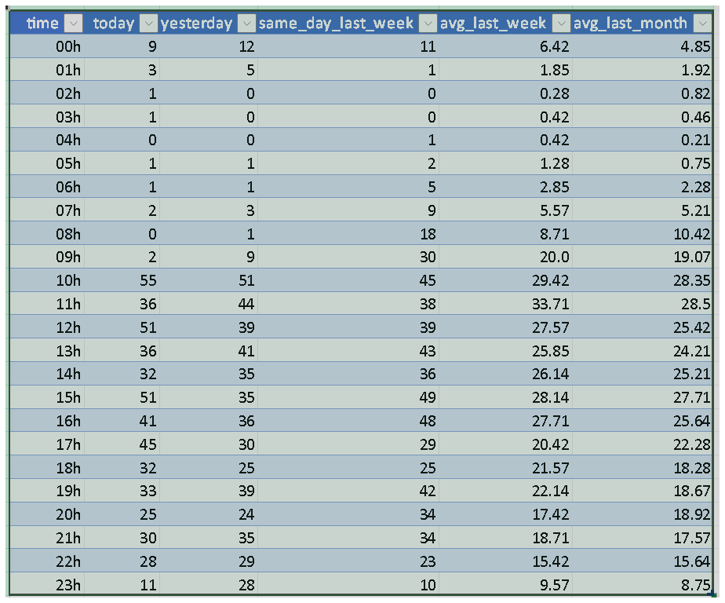
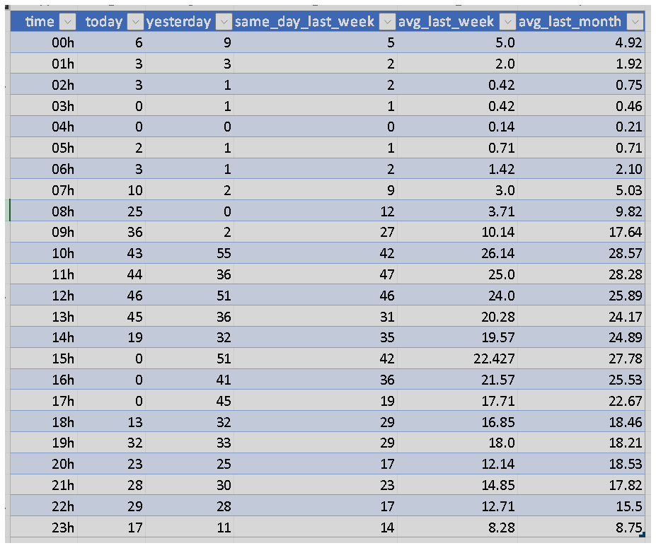

### Step 1: Load and Inspect Checkout Data

- **Checkout_1 Data:**

- **Checkout_2 Data:**


### Step 2: Code for Exploratory Analysis

- **Python Script Creation. File: "analise_checkout.py":**
```python
import pandas as pd
import re

# URLs for the datasets provided in the challenge
url1 = '[https://raw.githubusercontent.com/thais-menezes/monitoring/main/checkout_1.csv](https://raw.githubusercontent.com/thais-menezes/monitoring/main/checkout_1.csv)'
url2 = '[https://raw.githubusercontent.com/thais-menezes/monitoring/main/checkout_2.csv](https://raw.githubusercontent.com/thais-menezes/monitoring/main/checkout_2.csv)'

# Load the two CSV files into DataFrames
try:
    df1 = pd.read_csv(url1)
    df2 = pd.read_csv(url2)
    print("CSV files loaded successfully.")
except Exception as e:
    print(f"Error loading files: {e}")
    exit()

# Combine the two DataFrames into one
df_total = pd.concat([df1, df2], ignore_index=True)
print("DataFrames combined.")

# --- INSPECT THE DATA ---

# 1. View the first 5 rows to understand the structure
print("\n--- 1. Data Sample (head) ---")
print(df_total.head())

# 2. Get information about data types and null values
print("\n--- 2. General Info (info) ---")
df_total.info()

# 3. Get descriptive statistics for numerical columns
print("\n--- 3. Descriptive Statistics (describe) ---")
print(df_total.describe())

# 4. Clean the 'time' column to be numeric
# The 'time' column is in '00h', '01h' format. Converting it to a number (0, 1)
# makes sorting and plotting easier.
print("\n--- 4. Cleaning the 'time' column ---")
# We use a regular expression to extract only the digits
df_total['hour'] = df_total['time'].str.extract('(\d+)').astype(int)
df_total = df_total.sort_values(by='hour') # Sort by the hour of the day
print("Numeric 'hour' column created and data sorted.")
print(df_total.head())
````

  - **What is the reasoning behind the code?**
      - The approach is based on the **ETL (Extract, Transform, Load)** process.
      - In short, the code does the following:
          - **Extract:** It pulls raw data from different sources (the two CSV files).
          - **Transform:** It cleans and formats this data, converting the time column to a numeric format and sorting the table to be chronological.
          - **Load:** It makes the result (the clean, sorted table) available for the next step, which could be the actual analysis, chart creation, or report generation.
      - In summary, the code's function is to prepare "dirty" and disorganized data for useful analysis.

### Step 3: Python Code Execution

  - **Code Output:**

### Step 4: Identifying Anomalous Behavior

  - As the challenge asks to "understand if there is any anomalous behavior," the most direct way to do this is to compare the `today` column with the reference columns (`yesterday`, `avg_last_week`, `avg_last_month`).

  - To do this, I will add a code block to the "analise\_checkout.py" file that calculates the difference between today's sales and the average of the last week. This will highlight the hours where today's behavior was most unusual.

  - **New code with the addition of the exploratory analysis block:**

<!-- end list -->

```python
# (The initial code from Step 2 is the same...)
# Appended code:

# --- FIND THE ANOMALY ---

print("\n--- Anomaly Analysis ---")
# We will calculate the difference between today's sales and the previous week's average
df_total['diff_today_vs_avg_week'] = df_total['today'] - df_total['avg_last_week']

# Now, we sort the data to see where the difference was greatest (positive or negative)
df_sorted_by_diff = df_total.sort_values(by='diff_today_vs_avg_week', ascending=False)

print("\nHours with MORE sales than the weekly average:")
print(df_sorted_by_diff.head(5))

print("\nHours with FEWER sales than the weekly average:")
print(df_sorted_by_diff.tail(5))
```

  - **Code Output:**

  - **Analysis of the new output:**

      - The output provides two tables:
          - The 5 hours where `today`'s sales most exceeded the weekly average.
          - The 5 hours where `today`'s sales were most below the weekly average.
      - The focus is on the second table, "Hours with FEWER sales than the weekly average."

  - **Main Insight - Anomaly Found:**

      - The clearest and most critical anomaly is at the **15h (3 PM)** timestamp:

          - **`time`**: `15h`
          - **`today`**: `0`
          - **`avg_last_week`**: `22.427`
          - **`diff_today_vs_avg_week`**: `-22.427`

      - **Conclusion:** At 3 PM, sales for "today" dropped to zero, while the normal for that time (based on the previous week's average) would be approximately 22 sales. A total drop like this is a strong indicator of a **critical system failure (e.g., the payment gateway went down, a service went offline, etc.).**

### Step 5: Creating the SQL Query and Chart

  - **Action:** Transform this discovery into the two deliverables requested by the challenge.

  - **Reasoning:** The challenge asks for an SQL query that helps explain the anomaly. Even though I'm using Pandas, I will write the query as if the data were in a database. This query will select the necessary data for creating the chart.

  - **SQL Query:**

<!-- end list -->

```sql
-- Query to compare today's sales with the previous week's average, by hour.
-- The objective is to visualize the abrupt drop that indicates the anomaly.

SELECT
    time,
    today,
    avg_last_week
FROM
    checkouts -- (Imagining the data is in a table called 'checkouts')
ORDER BY
    CAST(REPLACE(time, 'h', '') AS INTEGER);
```

  - **Python Code for Chart Creation:**

  - **Reasoning:** The best way to display the anomaly is with a line chart. It will clearly show the `today` line dropping to zero while the average line remains stable.

  - **Code block added to the end of the `analise_checkout.py` script:**

<!-- end list -->

```python
import matplotlib.pyplot as plt

# --- GENERATE THE ANOMALY CHART ---

print("\n--- Generating anomaly chart ---")

# Configure the chart
plt.figure(figsize=(12, 6)) # Figure size

# Plot the lines
plt.plot(df_total['hour'], df_total['today'], marker='o', linestyle='-', label='Today\'s Sales')
plt.plot(df_total['hour'], df_total['avg_last_week'], marker='x', linestyle='--', label='Previous Week\'s Average')

# Add the anomaly annotation
plt.annotate('Anomaly: Total Sales Drop',
             xy=(15, 0), # Exact point of the anomaly
             xytext=(10, 10), # Position of the text
             arrowprops=dict(facecolor='black', shrink=0.05),
             fontweight='bold')

# Titles and labels
plt.title('Hourly Sales Comparison: Today vs. Previous Week\'s Average')
plt.xlabel('Hour of the Day')
plt.ylabel('Number of Sales')
plt.xticks(range(0, 24)) # Force all hour ticks on the X-axis
plt.grid(True, which='both', linestyle='--', linewidth=0.5)
plt.legend()

# Save the chart to a file and display it
plt.savefig('grafico_anomalia_checkout.png')
print("Chart saved as 'grafico_anomalia_checkout.png'")
plt.show()
```

  - **The Chart:**

  - **Analysis:** The chart clearly and unquestionably shows the discovered anomaly: the total drop in sales at 3 PM.
