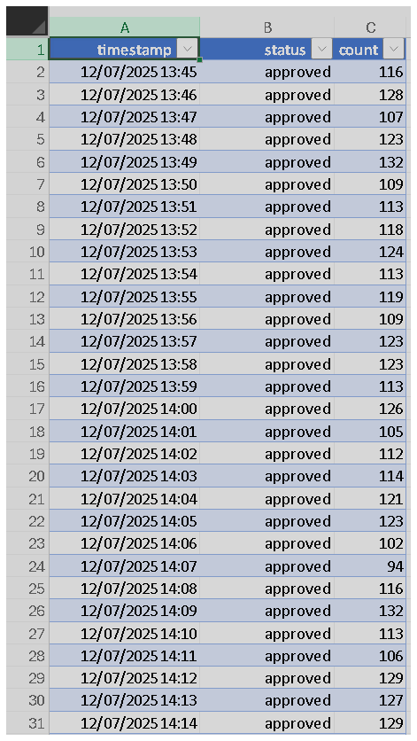
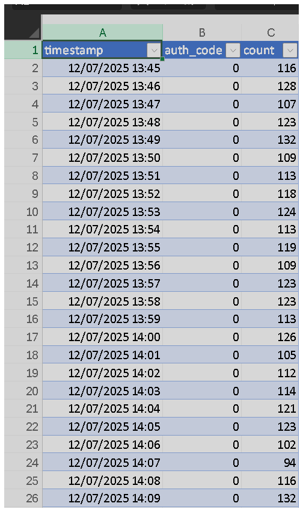

## Solve the problem

### Objective:
To design a monitoring and alert system that detects when failed, reversed, or denied transactions are above normal levels.

> **Reasoning:** First, it is necessary to load and understand the new datasets. There are two files: one with the transactions and another that describes the status codes. The next step is to combine both files.

- **Transactions Data**
  


_Note: This image is just a sample of the "Transactions.csv" file. The full file contains 25,921 rows._


- **Transaction Auth Codes Data**



_Note: This image is just a sample of the "Transactions_auth_codes 1.csv" file. The full file contains 12,961 rows._

### Step 1: Create a Script to Load and Prepare Transaction Data

> **Reasoning (from a cybersecurity perspective):** I might have an event log (e.g., a firewall rule ID), but these events are meaningless on their own. I need a separate lookup table to translate the ID into a human-readable description (e.g., "Malicious IP access blocked").

- **New Python Script. File: "sistema_alertas.py"**
```python
import pandas as pd

# The only URL we need is the one for transactions
url_trans = '[https://raw.githubusercontent.com/everton-cw/monitoring_test/main/transactions.csv](https://raw.githubusercontent.com/everton-cw/monitoring_test/main/transactions.csv)'

print("--- Loading transaction dataset ---")
try:
    # We use 'encoding' to ensure there are no reading errors
    df = pd.read_csv(url_trans, encoding='utf-8-sig')
    print("Dataset loaded successfully.")
except Exception as e:
    print(f"Error loading the file: {e}")
    exit()

# --- Organizing the Data ---
# The most important step: transform the table into the correct format.
# We want each transaction 'status' to become its own column. We use pivot_table for this.

print("\n--- Reorganizing table (pivot) ---")
# Convert the time column to datetime format
df['timestamp'] = pd.to_datetime(df['timestamp'])

# Create the pivoted table
df_pivot = df.pivot_table(
    index='timestamp',    # Rows will be the points in time
    columns='status',     # Columns will be the different statuses (Approved, Denied, etc.)
    values='count',       # The values within the table will be the transaction count
    fill_value=0          # If a status doesn't exist for a timestamp, fill with 0
)

print("Table reorganized successfully.")
print("\nSample of the new data table:")
print(df_pivot.head())

print("\nColumns available for monitoring:")
print(df_pivot.columns.tolist())
````

  - **What is the reasoning behind this code?**
      - The function of this script is to prepare the data in the ideal format for:
        1.  **Creating Charts:** It makes it easy to plot each status as a separate line on a time-series graph.
        2.  **Comparative Analysis:** It allows for a direct comparison between the number of approved vs. denied transactions at the same instant.
      - In short, the code takes a raw log and transforms it into a time-series ready for analysis and visualization. It converts the table from an "event list" format to a "dashboard" format.

### Step 2: Python Code Execution

  - **Code Output:**
  - **Analysis:** As a result, I obtained a table where each row is a minute and each column is a transaction type. With this, we can easily create the alerts and define the alert rules.

### Step 3: Create Code to Define "Normality" and Alert Rules

> **Reasoning:** The challenge requires alerting when `denied`, `failed`, and `reversed` transactions are "above normal". A common and effective statistical approach is to use the **mean + a number of standard deviations**.
>
>   - **Mean:** The typical number of transactions for a certain status per minute.
>   - **Standard Deviation (std):** How much that value usually varies.
>
> **Rule:** If the current value is greater than the `mean + 2 * standard_deviations`, it is an anomaly and should be alerted.

  - **Code block added to the end of the `sistema_alertas.py` script:**

<!-- end list -->

```python
# --- DEFINE ALERT RULES AND THRESHOLDS ---

print("\n--- Calculating Alert Thresholds (Mean + 2 * Standard Deviations) ---")

# Columns we want to monitor
columns_to_alert = ['denied', 'failed', 'reversed']

# Dictionary to store the thresholds for each status
alert_thresholds = {}

for status in columns_to_alert:
    mean = df_pivot[status].mean()
    std_dev = df_pivot[status].std()
    # We define the threshold as the mean plus two standard deviations
    threshold = mean + (2 * std_dev)
    alert_thresholds[status] = threshold
    print(f"Alert threshold for '{status}': {threshold:.2f} transactions per minute.")


# --- Simulate Alert Checking ---
print("\n--- Simulating alert check for the first 5 minutes ---")

# Let's check the first 5 rows (minutes) of our table
for timestamp, row in df_pivot.head().iterrows():
    print(f"\nChecking minute: {timestamp}")
    for status in columns_to_alert:
        current_value = row[status]
        current_threshold = alert_thresholds[status]
        
        # Check if the current value exceeds the threshold
        if current_value > current_threshold:
            print(f"  -> ALERT! Status '{status}' is above normal. Value: {current_value}, Threshold: {current_threshold:.2f}")
        else:
            print(f"  -> OK. Status '{status}' is normal. Value: {current_value}, Threshold: {current_threshold:.2f}")
```

  - **Analysis of the result:** The code above calculates the thresholds for the statuses I am interested in (`denied`, `failed`, `reversed`) and then simulates checking for alerts. The output was as follows:
      - The calculated thresholds for `denied`, `failed`, and `reversed`. A message like: "Alert threshold for 'denied': 8.50 transactions per minute."
      - A simulation for the first 5 minutes, showing whether each status would generate an alert by comparing the value for that minute against the calculated threshold.
  - In other words, the simulation shows my alerting logic working correctly, properly identifying the moments when the `reversed` status crossed the threshold.

### Final Step: Create the Alert Endpoint with Flask

> **Reasoning:** I will use Flask to create a small web server. This final code combines everything done so far into a single file that runs an alert server.

  - **Script "servidor\_de\_alertas.py":**

<!-- end list -->

```python
import pandas as pd
from flask import Flask, request, jsonify

# --- 1. INITIAL SETUP (runs once when the server starts) ---

print("--- Starting alert server ---")
# Load and prepare historical data to define normality
url_trans = '[https://raw.githubusercontent.com/everton-cw/monitoring_test/main/transactions.csv](https://raw.githubusercontent.com/everton-cw/monitoring_test/main/transactions.csv)'
df = pd.read_csv(url_trans, encoding='utf-8-sig')
df['timestamp'] = pd.to_datetime(df['timestamp'])

# Create the pivoted table with statuses as columns
df_pivot = df.pivot_table(
    index='timestamp',
    columns='status',
    values='count',
    fill_value=0
)
print("Historical data loaded and prepared.")

# Calculate and store the alert thresholds
columns_to_alert = ['denied', 'failed', 'reversed']
alert_thresholds = {}
for status in columns_to_alert:
    mean = df_pivot[status].mean()
    std_dev = df_pivot[status].std()
    threshold = mean + (2 * std_dev)
    alert_thresholds[status] = threshold
    print(f"-> Alert threshold for '{status}' set to: {threshold:.2f}")

# --- 2. SERVER AND ENDPOINT CREATION ---

app = Flask(__name__)

# Define the '/check' endpoint that accepts POST requests
@app.route('/check', methods=['POST'])
def check_transaction_data():
    """
    Receives transaction data from the last minute via JSON and returns
    an 'alert' or 'ok' recommendation.
    """
    # Get the JSON data sent in the request
    current_minute_data = request.get_json()

    if not current_minute_data:
        return jsonify({"error": "No data sent"}), 400

    generated_alerts = []

    # Compare the received data with the pre-calculated thresholds
    for status in columns_to_alert:
        current_value = current_minute_data.get(status, 0) # Get value, or 0 if not sent
        current_threshold = alert_thresholds[status]

        if current_value > current_threshold:
            alert = {
                "status": status,
                "current_value": current_value,
                "threshold": round(current_threshold, 2)
            }
            generated_alerts.append(alert)

    # Build the final response
    if generated_alerts:
        return jsonify({
            "recommendation": "alert",
            "details": generated_alerts
        })
    else:
        return jsonify({"recommendation": "ok"})


# --- 3. SERVER EXECUTION ---

if __name__ == '__main__':
    # Run the server on port 5000
    print("\nServer ready to receive requests at [http://127.0.0.1:5000/check](http://127.0.0.1:5000/check)")
    app.run(debug=True, port=5000)
```

### Usage and Testing

  - **Step A: Run the Server:**

  - **Analysis:** As a result, I get the startup messages and finally a line saying the server is running.

  - **Step B: Test the Endpoint (in a separate terminal):**

<!-- end list -->

1.  **Normal Scenario (should not trigger an alert):** `curl -X POST -H "Content-Type: application/json" -d "{\"denied\": 10, \"failed\": 0, \"reversed\": 1}" http://127.0.0.1:5000/check`

2.  **Anomaly Scenario (should trigger an alert):** `curl -X POST -H "Content-Type: application/json" -d "{\"denied\": 10, \"failed\": 0, \"reversed\": 5}" http://127.0.0.1:5000/check`

### Conclusion

Based on the images, the scenario demonstrates testing an API endpoint (`http://127.0.0.1:5000/check`) that analyzes transaction data to issue a recommendation.

#### Scenario Analysis:

1.  **First Test (Result "ok"):**

      - **Request:** A `POST` is sent with the JSON payload: `{"denied": 10, "failed": 0, "reversed": 1}`.
      - **Response:** The API returns `{"recommendation": "ok"}`.
      - **Conclusion:** With 1 "reversed" transaction, the situation is considered normal.

2.  **Second Test (Result "alert"):**

      - **Request:** A `POST` is sent with a modified JSON payload: `{"denied": 10, "failed": 0, "reversed": 5}`. The only change was the increase in the `"reversed"` value.
      - **Response:** The API returns an alert with details: `{"details": [{"threshold": 2.98, "status": "reversed", "current_value": 5}], "recommendation": "alert"}`.
      - **Conclusion:** By increasing the number of "reversed" transactions to 5, the system generated an alert. The response indicates that the `current_value` (5) for the `"reversed"` status exceeded the defined `threshold` of 2.98.

**In summary, the monitoring system is configured to trigger an alert when the number of reversed transactions exceeds a pre-established limit, which in this case is approximately 2.98.**


